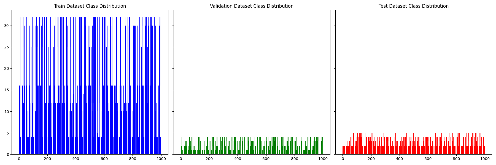
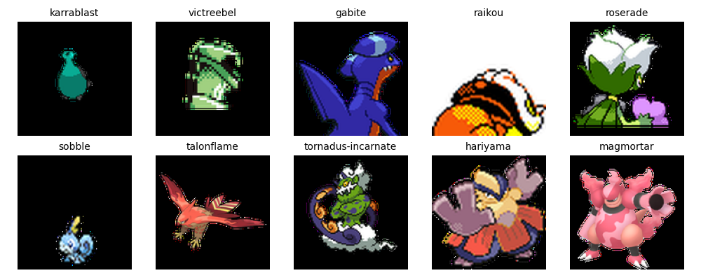

# Dataset Statistics Report

This report provides an overview of the dataset statistics for the PokeDataset. The statistics include the number of images, image shapes, and class distributions for the train, validation, and test datasets.

## Dataset Information

### Train Dataset
- **Number of images:** 20921
- **Image shape:** torch.Size([3, 128, 128])

### Validation Dataset
- **Number of images:** 2379
- **Image shape:** torch.Size([3, 128, 128])

### Test Dataset
- **Number of images:** 3239
- **Image shape:** torch.Size([3, 128, 128])

## Class Distribution

The class distribution for the train, validation, and test datasets is shown in the plot below:

- **Blue bars:** Train Dataset
- **Green bars:** Validation Dataset
- **Red bars:** Test Dataset

The plot provides a visual representation of the frequency of each class in the respective datasets.

## Sample Images from Random Classes

Below is a grid of sample images randomly selected from different classes in the train dataset. Each image is labeled with its corresponding class name.

This visualization provides insight into the variety of classes and their visual representation within the dataset.

## Conclusion

This report summarizes the key statistics of the PokeDataset, including the number of images, image shapes, class distributions, and sample images from random classes. The class distribution plot and sample grid help in understanding the dataset's structure and balance.
